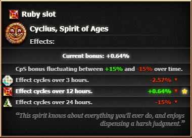

# Cyclius Calculator Mod
Hello, this is my first ever mod for cookie clicker, its based on a <a href="https://zypa.github.io/cyclius-calc/">website</a> i made of the same name, now the features are just implemented directly into the game.
As this is my first Cookie Clicker mod id love to hear feedback on how to improve it.

If you have any sort of experience with the modding api for Cookie Clicker and have the time to look through the code (dont worry, its a very small mod), it would be awesome if you could give feedback in regards to what i did wrong etc, as this mod was thrown in a hurry, i have probably not used the correct hooks or anything like that.

</img>

# Current features:
- Shows you the current bonuses of all the slots.
- Shows you whether theyre increasing or decreasing.
- Suggests what the best slot would be right now. (Currently it has no idea what your currently active slot is. so it cant make decisions based on that. it only looks an hour ahead, and checks which slot has the highest average score for that hour.)
- Poorly optimized code :D

# Planned features:
- Make the suggestion part, also consider your currently active slot.
- Optimize the code.
